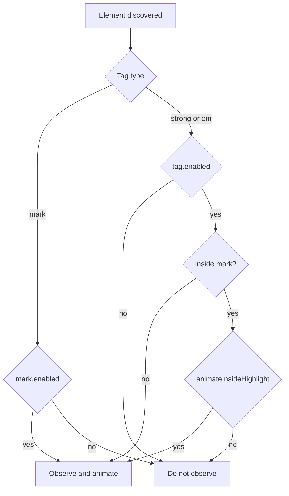

# Float Animation State Diagram

This document defines how animation eligibility is decided for `mark`, `strong`, and `em`.

## Inputs

- `Tag`: `mark` | `strong` | `em`
- `InsideHighlight`: whether `strong`/`em` is nested inside a `mark`
- `Enable highlight float` (`mark.enabled`)
- `Enable bold float` (`strong.enabled`)
- `Enable italic float` (`em.enabled`)
- `Animate bold/italic inside highlights` (`animateInsideHighlight`)
- `Animate word only` (`animateWordOnly`) - affects animation target, not eligibility

## Decision Flow

## Priority Rules

- In block mode (`animateWordOnly = false`), multiple active tags can map to the same container.
- Effective visual tag priority is:
  1. `mark`
  2. `strong`
  3. `em`
- Therefore, if a highlight is active in a container, highlight animation wins for that container.

## Truth Table

### `mark` element

| mark.enabled | Animate mark? |
|---|---|
| false | No |
| true | Yes |

### `strong` or `em` outside highlight

| tag.enabled | Animate tag? |
|---|---|
| false | No |
| true | Yes |

### `strong` or `em` inside highlight

| tag.enabled | animateInsideHighlight | Animate nested tag? |
|---|---|---|
| false | false/true | No |
| true | false | No |
| true | true | Yes |

## Static.md Test Matrix

Testing file: `/home/karthikraju/notes/Technical/OOP/Static.md`

- Nested bold inside highlight sample: line 8 (`==... **before any objects exist** ...==`)
- Nested bold inside highlight sample: line 69 (`==... **resolving** ...==`)
- Independent bold/italic sample: line 5 (`*methods*`, `**static**`)

Expected:

1. `mark=ON`, `strong=OFF`, `em=OFF`: line 8/69 highlight still animates.
2. `mark=OFF`, `strong=ON`, `em=ON`, `animateInsideHighlight=ON`: nested bold/italic in line 8/69 animates.
3. `mark=OFF`, `strong=ON`, `em=ON`, `animateInsideHighlight=OFF`: nested bold/italic in line 8/69 does not animate; line 5 bold/italic still animate.
4. `mark=ON`, `strong=ON`, `em=ON`, `animateInsideHighlight=ON`: highlight remains primary in block mode; nested inline animations appear when using word-only mode.
